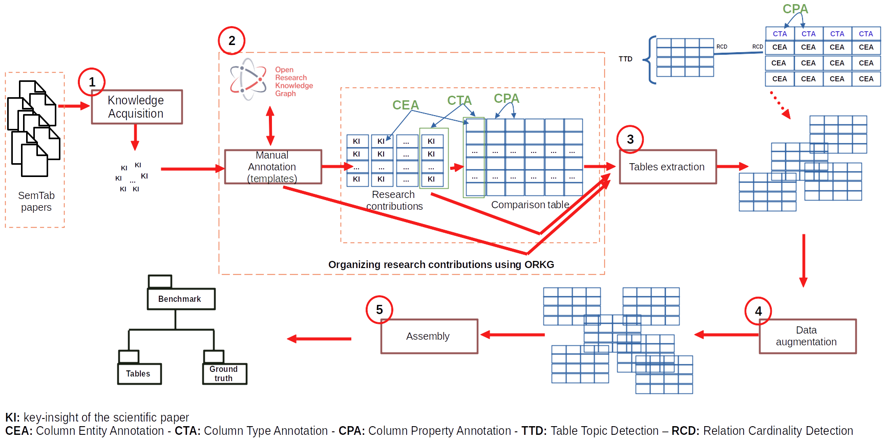

# SemTabTable-Papers
* This is a dataset of papers published by SemTab@ISWC, annotated using Open Research Knowledge Graph and adapted so that they can be used during the next editions of SemTab challenge
* It is based on papers published by SemTab@ISWC since 2019
* We used the data augmentation technique to make it more larger for semantic table annotation (STA) tasks. We identified all the [problems that can be found in tabular datasets](https://orkg.org/) and reported by SemTab authors and we introduce these errors in the dataset.
* The target Knowledge Graph is [**Open Research Knowledge Graph**](https://orkg.org/)

## Annotation tasks are:
This dataset involve all the annotation tasks proposed by SemTab with additional annotations [https://sem-tab-challenge.github.io/2023/]:
 * CEA: Cell Entity Annotation consisting of matching individual cells of the tables to entities from Knowledge Graph,
 * CTA: Column Type Annotation, consisting of assigning a semantic type (an ORKG class as fine-grained as possible) to a column
 * CPA: Column Property Annotation, consisting of assigning a Knowledge Graph property to the relationship between two columns
 * TTD: Table Topic Detection, consisting of assigning a Knowledge Graph class to a table
 * RCD: Relation Cardinality Detection, consisting of detecting, given two tables the cardinalities of the associations between these tables.

## SemTabTable-Papers construction

* The figure above presents the pipeline we are using to get the papers, acquire knowledge from them, organizing these knowledge into research contributions and comparing these contributions. Thereafter, the extraction of knowledge from templates, comparisons tables and contributions to build the benchmark. Data augmentation is used to add errors found in tabular datasets by SemTab authors in this dataset.
* All the papers published by SemTab@ISWC since 2019 were downloaded. Paper metadata were automatically extracted from these papers using ORKG and
  key-insights were extracted and ingested into ORKG manually.
* For each table, we have applied a set of data augmentation techniques given by [/script/augment](\scripts\augment)
  `template.py` shows the augmentation technique that we applied on `templates` extracted from ORKG (you can find it under [\input_data\template\template_1](\input_data\template\template_1)
* Then, we have annomyzed the file names using `python UUID` as shown at [\script\reconcile](\script\reconcile), the output is presented [/tables](/benchmark/tables)

## SemTabTable-Papers benchmark
SemTabTable-Papers benchmark ([/SemTabTable-Papers/benchmark]) or [Zenodo](link2Zenodo) consists of 2 folders:
 * [/tables](benchmark/tables): this folder contains the tables to be annotated
 * [gt/](/benchmark/gt) is the ground truth which demonstrate the output results. It consists of the following elements:
    * SemTabTable-Papers_CEA_Targets.csv: list of the required cells to be annotated (CEA task)
    * SemTabTable-Papers_CTA_Targets.csv: list of the required columns to be annotated (CTA task)
    * SemTabTable-Papers_CPA_Targets.csv: list of the required properties to be annotated (CEA task)
    * SemTabTable-Papers_TTD_Targets.csv: list of the required tables to be annotated (CEA task)

## Baseline annotator
The [baseline annotator](sourceCode/baselineAnno) is a simple system that uses the ORKG API to make queries on the ORKG Knowledge Graph.

## Citation

* Any publication using this dataset needs to contain citations of the underlying datasets.

```
@inproceedings{SemTabTable-Papers,
	title={{SemTabTable-Papers: a dataset of scientific papers published by SemTab@ISWC and annotated using Open Research Knowledge Graph}},
	author={Azanzi, Jiomekong and Allard, Oelen and Sanju, Tiwari and Gaoussou, Camara and Söeren, Auer},
	booktitle={SemTab@ISWC, submitted},
	year={2023}
}

@dataset{AJiomekongSemTabTablePapers2023,
  author       = {Azanzi Jiomekong and
                  Allard Oelen and
                  Sanju Tiwari and
                  Gaoussou Camara and
                  Söeren Auer},
  title        = {SemTabTable-Papers dataset},
  month        = jul,
  year         = 2023,
  publisher    = {Zenodo},
  version      = {1.0},
  doi          = {10.5281/zenodo.8165417}
}

```

## Acknowledgment
* The authors thanks neuralearn.ai for the code. We would like to especially thank Mr. Folefac Martins, the neuralearn.ai engineer who facilited the
  acquisition of the fund to build all the source code and make it open source.

